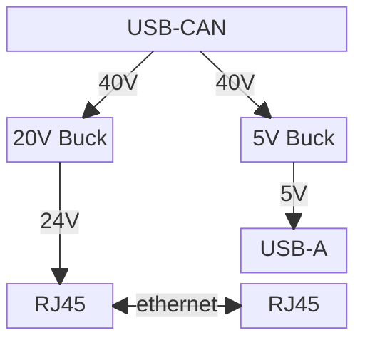
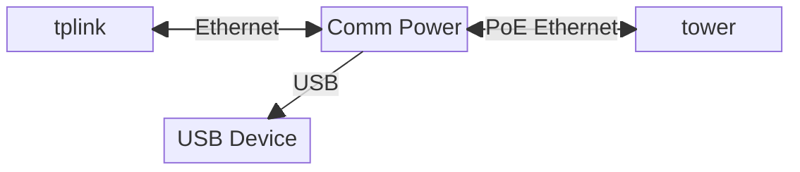

# Communications Power Board

## Features

- USB-CAN
- Passive PoE (12V)
- USB-A Power (12V)

## Authors

Board Design

- Sofia F

PCB Build

- Shin Umeda

Documentation

- Shin Umeda

## Active Revisions

- Rev A

## Compatibility Notes

N/A

## Summary

The communications power board (often referred to as simply the comm board) is
a passive PoE injector combined with a powered USB plugs. It utilizes a daughter
board buck converter as well as a built-in buck to step down the 40V power from
the USB-CAN to 24V for the PoE and 5V for the USB.

## Functional Block Diagram

## Typical Application

## Known Issues

- Noticeable coil whine
- Some capacitors are too small, one is too big
- Actually outputs 26V
